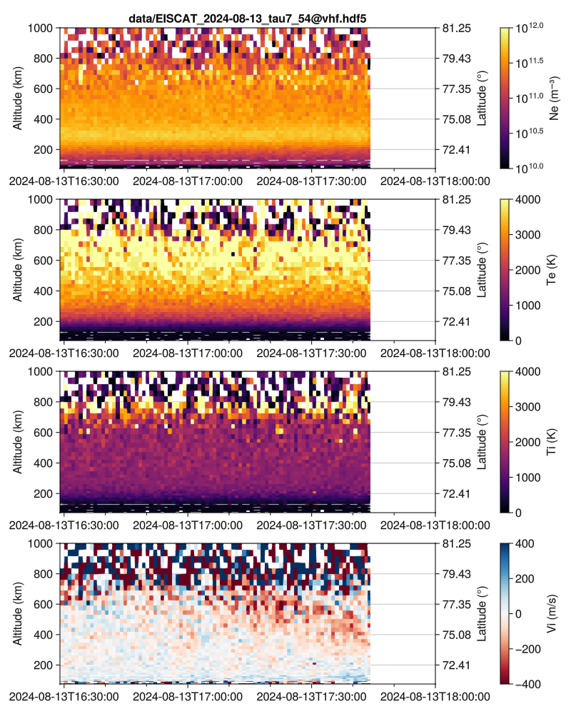

Julia script originally written during the EISCAT radar school 2024, to plot data from EISCAT ISR.

Can read `.hdf5` data downloaded from Madrigal or produced directly by GUISDAP.

Make plots like this one ⬇️



## How to run
1. If not already done, install Julia ()
2. Download the repository, either with git or as a `.zip`
3. The first time you run the code, you will need to initialize the environment.
   You can read how packages and environments work in Julia  and .
   Here are some quick instructions:
   - Start Julia from inside the folder where the code was installed
   - Move into package mode by pressing  `]`  on your keyboard
   - Activate the local environment with the command `activate .`
   ```julia
   julia> # here press `]` to enter package mode
   (@v1.11) pkg> activate .
     Activating project at `~/Documents/Julia/EISCAT_radar_school`
   (EISCAT_radar_school) pkg> 
   ```
   - Now instantiate the environment with the command `instantiate`. This will download and install the packages that are required for the script to work.
   ```julia
   (EISCAT_radar_school) pkg> instantiate
   ```
   - you can read more about how packages and environments work in Julia  and .
5. There are different ways to run code in Julia. One of them is to launch the script with this command
   ```julia
   julia> include("load_and_plot.jl")
   ```
